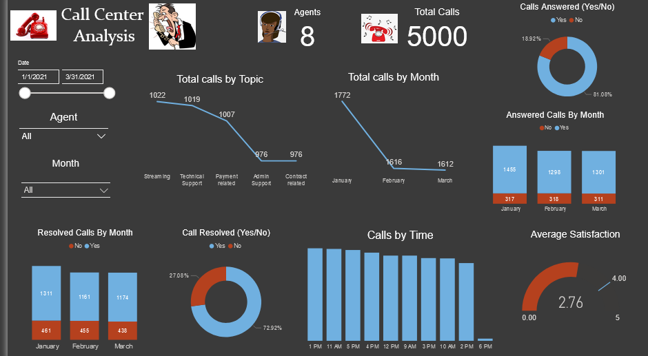

## Call-Center-Analysis

### Introduction

It is the goal of every business venture to serve its customers and provide essential services that benefits its customers. With same business scattered all over the globe, and sometimes same business by different owners situated in the same country, competition becomes tough and each business strives to outperform its competitors.

And while businesses compete for a fair share of the consumer market, they are also bound to run background or inhouse audit of their business to verify if they are meeting their set out goals and laid down targets which could be either for a quarter or full financial year. 

This helps them to ascertain extents to which they have their goals actualized and also gauge the level of satisfactory trust their customers have bestowed on them.
For without these analyses, no business entity can survive the harsh competition of the market.
    
With this background introduction, this report aims to give insights into a mobile service provider amount of calls received by its agents for a given quarter of the year.

### Problem Statement

Mr. Abu, the head of service, customer division for Ricco services, a mobile service provider, has requested for data related to calls handled by agents for the first quarter of the financial year. He alleges that he has received through customer feedbacks, some series of worrisome complaints about the ineffectiveness of the service provider to carry out its responsibilities to the general public.

Ricco services ranks among the top competing service providers in the country, and the head of service is worried that if customer negative complaints persist, customer may eventually churn and move to other service provider that meets its needs.
There has also being complaints by customers that their pain points are not being addressed by agents, and in most cases their calls are being rejected without they (customers) getting a solution.
    
Apart from the negative feedbacks, he also wants to know how well the business is going, the channels for which the customers are calling in for support, the amount of customer representative calls that have been processed, the agents who are on duty and how their work rate differs.

Also, of important interest to him is which time of the day does the business receives most of its customer support calls.
This he believes if given proper attention will help gauge the success and level of progress of the business and the what next step for the next quarter of the year will be ascertained.
    
The analytical services of Koko and sons’ analytics has been requested to help the business using its generated data come up with useful insights that will help the business make data driven useful decisions.

### Objective
    Gain insights into the amount of calls received in the first quarter
    Understand the amount of calls being handled by each agent
    Gain insights into the percentage of calls which were resolved and unresolved.
    To reduce the risk of customers churning
    To increase marketing tactics by directing efforts towards known channels and less know channels

### Analytical Technique
    Descriptive Analysis

### Business Benefits
    Low rate of churning by customers
    More customer trust to its service provider to deliver on essential services
    More customer to business relationship

### Business Questions
    How many calls was received from January to March?
    Which topic had the most call
    Time of the day with most calls
    Which agent handled the most calls
    The percentage of calls resolved and unresolved
    The percentage of calls answered and unanswered
    Customers average satisfaction rating

## Data Understanding
    Data of a call center customer care call request from January - March
    Dataset has 9 columns and 5000 rows

### Data Dictionary
    Call id – Unique id identifying each call
    Agent – Name of customer care representative
    Date – Date call was received
    Time – Time of call	
    Topic – Category of customer call complaint
    Answered – Whether call was answered (yes/no)
    Resolved – Whether call was resolved by agent (yes/no)
    Speed of answer in seconds – The time in seconds before call was answered or rejected
    Satisfaction rating – The satisfaction rating given by the customer

## Data Preparation

    Power Query – Data Cleaning
    Power BI – Visualization

## Findings

For the first quarter of the year, January – March, eight agents were on duty with a total of 5000 calls were received. Streaming topics had the most number of calls with a sum total of 1022 calls, while technical support topics ranked second with a total of 1019 calls.

The month of January saw the most number of calls being received in the center, followed by a decline in the months of February and March.
72.92% of calls were resolved by the call agents, while 27.08% went unresolved. The agents recorded more answered calls as depicted by 81.08%, with 18.92% not answered.
Customer average satisfaction rate stood at 2.76% as against the 4.00% benchmark, which was a poor rating.
The hours of 1pm, 11am, 5pm and 4pm were the time of the day when agents received most customer support calls.

Agent Jim received a total call of 666, while agent Martha, Dan and Diane received total calls of 638, 633, 633   respectively. 
  
Agent Jim had more customer support attention geared towards contract related and admin support, handled most calls at 11am, 12pm and 5pm. Answered 536 calls representing 80.48%, and resolved 485 calls that came to his desk, calculated at 72.82% of answered calls.

Agent Martha customer support calls were mostly support calls on technical support, streaming and contract related. Time with the most of calls were around 9am, 10am and 12pm. Answered 80.25% of customer complaints calls and resolved 72.26% of those queries.

## Recommendations

* More customer care attention should be geared towards streaming services, Contract related and technical support as these were where most customer calls emanated the most.

* Although low, the rate at which calls were left unanswered and unresolved should be taken into consideration. 

* These customers who were left unattended to might feel the need the churn and port to other service providers.

* More marketing tactics should be rolled out to customers, making them more enlighten on how to use a certain service. It is believed that the number one reason why there are most calls was because customers do no understand how to use a particular service well.

